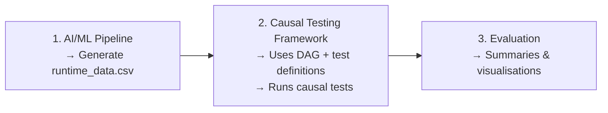

# causal-ai
### A tool for evaluating AI workflows using the Causal Testing Framework

[](https://www.repostatus.org/#active)




This repository contains `causal-ai`, a tool for evaluating AI/machine learning workflows using the [Causal Testing Framework (CTF)](https://github.com/CITCOM-project/CausalTestingFramework). It was developed by [University of Sheffield Research Software Engineers](https://rse.shef.ac.uk/) as part of the [N8 CIR AI4Science](https://gtr.ukri.org/projects?ref=UKRI2699) project for the [Bede HPC cluster](https://n8cir.org.uk/). This codebase also includes a set of case studies built on [PyKale](https://pykale.github.io/) pipelines.

The central idea of this tool is that rather than re-running expensive experiments, users/researchers can apply causal inference retrospectively to data already collected from prior workflow runs to identify what actually drives model behaviour, both functionally (e.g. accuracy, loss) and non-functionally (e.g. training time, memory usage, numerical stability).
> [!NOTE]
> The PyKale framework was chosen as a representative example. The provided data collection scripts can be modified and applied to other AI/ML frameworks, such as PyTorch.

## Motivation

Systematically evaluating the effect of configuration choices in ML pipelines, such as floating point precision, batch size, or optimiser, typically requires controlled experimentation that is expensive to run at scale on HPC systems. 
Causal testing offers an alternative: by modelling the expected causal structure of a pipeline and applying statistical estimation to observational data already collected from prior runs, it's possible to identify causal effects and quantify uncertainty around them.

Some of the questions this tool is designed to answer:

- Does reducing floating point precision from fp32 to fp16 significantly reduce GPU memory usage?
- Does batch size have a causal effect on domain adaptation accuracy?
- Are these effects reproducible across different HPC architectures?

## How it works

1. Data collection - Create training scripts with a lightweight data collector to capture input variables (hyperparameters, precision settings) and output variables (metrics, timing, memory usage) across many experimental configurations, producing a `runtime_data.csv`.
2. Causal DAG (`dag.dot`) - Define a directed acyclic graph (DAG) encoding the hypothesised causal relationships between variables (e.g. `fp_precision → gpu_memory_peak_mb`).
3. Causal testing - Use the CTF command-line interface to estimate causal effects, compute confidence intervals, and test whether the data supports or refutes each hypothesised relationship.
4. Outputs - The tool produces three types of output from the causal test results:
   - Terminal summaries — pass/fail/skip counts per cluster, with `--json` for structured output
   - Cross-cluster comparison  highlights divergent tests (passed on one cluster, failed on another) to identify platform-dependent effects
   - Visualisations - one PNG per causal test showing the DAG with the tested edge highlighted (green = passed, red = failed), plus a summary heatmap across all tests

## Installation

For local development and running tests:
```bash
pip install -e ".[dev]"
```

For running experiments on HPC systems (e.g. Bede), create the full conda environment which includes PyTorch, PyKale, and all example dependencies (resolved using only the `conda-forge` channel):
```bash
conda env create -f environment.yml # the environment.yml file assumes a specified prefix configured to Bede's filesystem
conda activate ai-4-science
pip install -e ".[dev]"  # layer the package on top in editable mode
```


## Usage

### Command-line interface

Summarise the causal test results for a single cluster:

```bash
python -m causal_ai summary examples/digits_dann/data
```

Compare results across clusters:

```bash
python -m causal_ai compare examples/digits_dann/data
```

Both commands accept `--json` for structured output suitable for downstream analysis.

Generate visualisations of causal test results:

```bash
python -m causal_ai visualise \
    --dag examples/digits_dann/data/dag.dot \
    --results examples/digits_dann/data/causal_test_results.json \
    --output_dir output/visualisations
```

This produces one PNG per causal test (the full DAG with the tested edge highlighted in green if passed or red if failed, dashed for independence tests) and a `summary.png` heatmap showing pass/fail/skip across all tests at a glance.

### Data collector

The `PyKaleCausalDataCollector` instruments existing PyKale training scripts to record experimental configurations and outcomes:

```python
from causal_ai import PyKaleCausalDataCollector

collector = PyKaleCausalDataCollector("output/runtime_data.csv")

collector.log_config({"learning_rate": 0.001, "batch_size": 64, "fp_precision": "fp16"})

collector.start_timer("training")
# ... training loop ...
collector.end_timer("training")

collector.log_metrics({"test_target_acc": 0.95, "test_loss": 0.03})
collector.log_memory_usage(131.9, device="gpu")

collector.save_run()
collector.export_data()
```

The resultant CSV can be used directly as the runtime data input to the Causal Testing Framework.

## Project structure

```
causal_ai/              Core package (data collector, artifact loaders, CLI)
docs/
  tutorial_cli.ipynb        Step-by-step CLI tutorial (recommended starting point)
  tutorial_api.ipynb        Python API tutorial for integration and custom analysis
examples/
  digits_dann/              Digit classification domain adaptation (MNIST → USPS)
  action_dann/              Video domain adaptation (EPIC-Kitchens)
  office_multisource_adapt/ Multi-source image domain adaptation (Office-Caltech)
tests/                  Unit tests
modulefiles/            Lmod module definition for Bede
scripts/                HPC installation helpers
```

## Unit Tests and CI

Run the test suite locally with:
```bash
python -m pytest
```

Tests run automatically on all pull requests and pushes to `main` via Actions, across Python 3.10, 3.11 and 3.12. 
The workflow lints with `ruff` before running `pytest`. See `.github/workflows/ci.yml`.

## HPC deployment

On Bede, the framework can be made available to project members via the module system:

```bash
bash scripts/install_bede.sh
```

After installation:

```bash
module use /nobackup/projects/bddur53/causal-ai/modulefiles
module load causal_ai/0.1.0
```

## Case studies

### Digits DANN (MNIST → USPS)

Domain adaptation for digit classification using DAN, DANN, and CDAN methods. A full factorial grid over batch size, optimiser, learning rate, floating point precision, and adaptation method was executed with 5 seeds per configuration, yielding 960 runs. See `examples/digits_dann/` for data collection scripts and results.

### Action DANN (EPIC-Kitchens)

Video-based domain adaptation across kitchen environments using the same experimental grid. Collection scripts are provided in `examples/action_dann/`; execution requires pre-downloading the EPIC-Kitchens video frames.

### Office Multi-Source (Office-Caltech)

Multi-source image domain adaptation using M3SDA, MFSAN, and DIN methods on the Office-Caltech dataset (amazon, webcam, dslr, caltech domains). Uses a ResNet-18 feature extractor and the same 960-run experimental grid. See `examples/office_multisource_adapt/` for data collection scripts.

## Acknowledgements 

This work was supported by the UK's Engineering and Physical Sciences Research Council (EPSRC), with the project name [N8/Bede: AI4Science](https://gtr.ukri.org/projects?ref=UKRI2699) under the grant UKRI2699.
